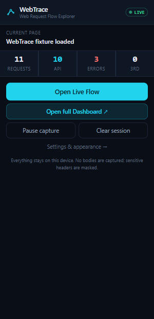
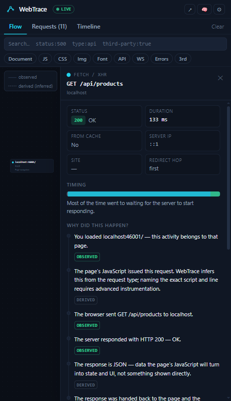
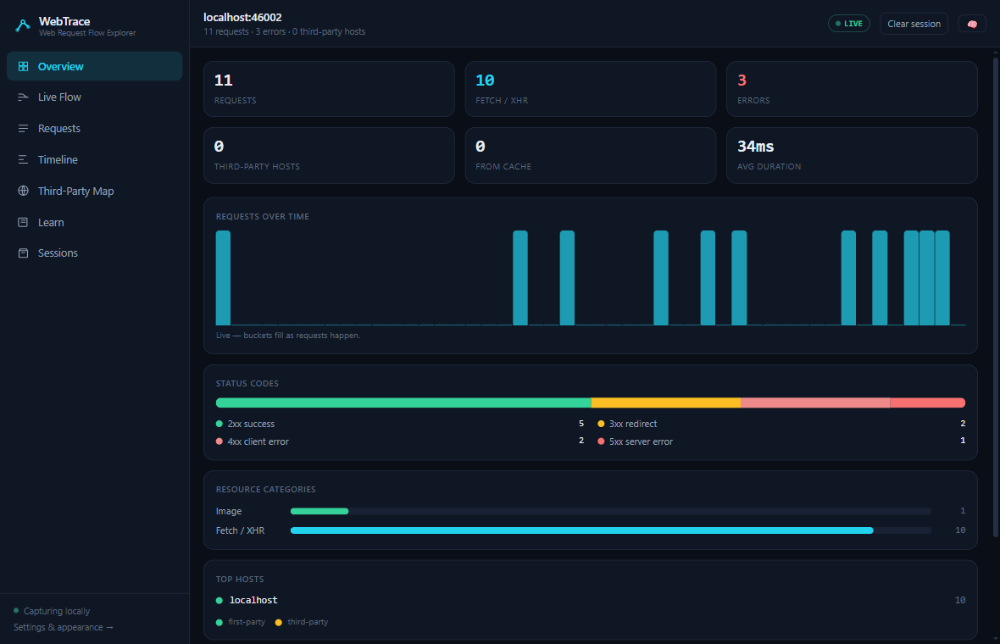
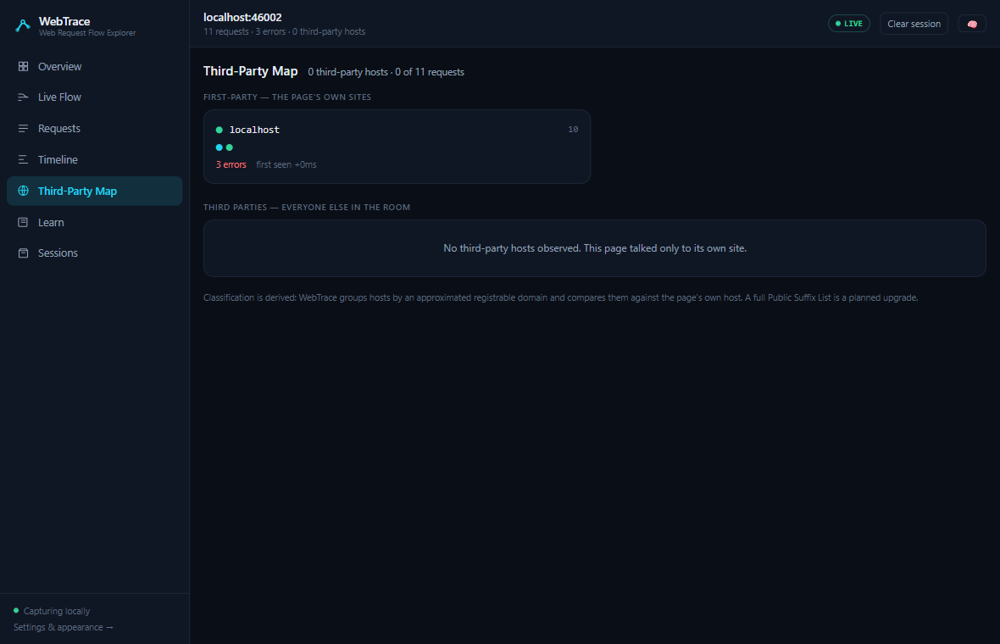
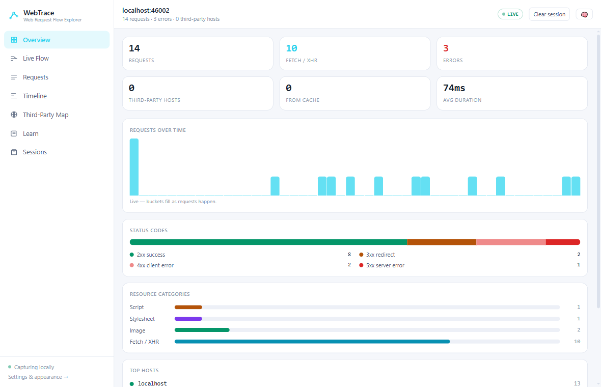
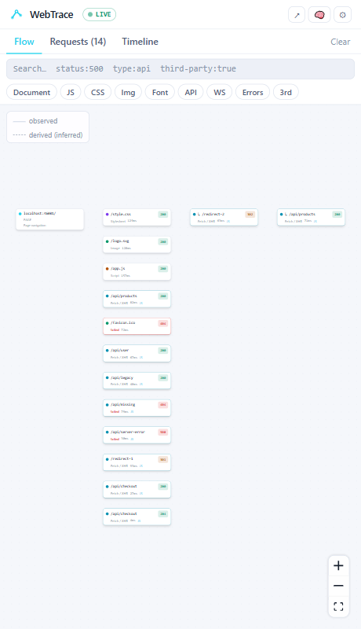
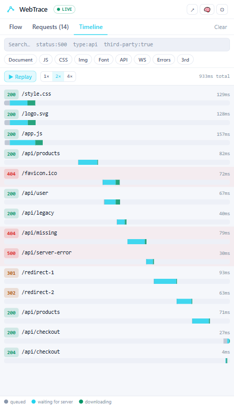

<div align="center">


# WebTrace

**Web Request Flow Explorer**

*See how the web actually works.*

A local-first browser extension for developers and learners that turns network
activity into an interactive, explainable flow — what happened, why it happened,
who started it, and what came next.

[](https://github.com/uzairr-arif/WebTrace/actions/workflows/ci.yml)
[](https://github.com/uzairr-arif/WebTrace/releases)
[](#development)
[](#development)
[](LICENSE)


**Install:** [Chrome Web Store](https://chromewebstore.google.com/) · [Edge Add-ons](https://microsoftedge.microsoft.com/addons) *(stores pending review — links land here)*

**Source:** [GitHub](https://github.com/uzairr-arif/WebTrace) ·
**Documentation:** [Architecture](docs/architecture.md) · [Development](docs/development.md) · [Privacy](docs/privacy.md) · [Changelog](CHANGELOG.md)

</div>

---

## What makes it different

DevTools tells you *what happened*. WebTrace answers the questions that actually matter:

> **What happened → why?** · **Who initiated it?** · **What happened next?**

…with a flow graph you can explore, plain-language explanations, and one rule
enforced everywhere: every claim is labeled

- **OBSERVED** — the browser itself reported it
- **DERIVED** — WebTrace inferred it, and says so

WebTrace never pretends to see more than a browser can. That honesty is the feature.

## Demo

**Dark theme**

<p align="center">
  
  
  
</p>

<p align="center">
  
  
</p>

**Light theme — side panel**

<p align="center">
  
  
</p>

## Highlights

- **Live Flow** — an interactive graph that builds itself as a page loads:
  documents, scripts, styles, images, fonts, API calls, redirect chains and CORS
  preflights, connected by honest edges (dashed = derived, solid = observed).
- **Explain stories** — "Why did this happen?" narratives for redirects, CORS
  preflights, 401s, 404s, network failures (`net::ERR_*` decoded) and cache
  revalidation — every step evidence-tagged.
- **Full dashboard** — Overview charts (requests over time, status mix, categories,
  top hosts), the flow on a big canvas, and a **Third-Party Map** grouping every
  host first-party vs third-party.
- **Timeline & replay** — a waterfall with queued / waiting / download phases,
  replayable at 1×, 2×, 4×.
- **Search that understands** — a mini query language: `status:500`, `type:api`,
  `third-party:true`, `method:POST` — plus quick filter chips.
- **Learning Mode** — glossary tooltips (CORS, TLS, DNS, 304, preflight…) over
  real traffic, and an 8-lesson curriculum with quizzes and local progress:
  *the tool that teaches what it shows*.
- **Sessions** — every capture is stored locally; reopen and replay any past
  session, or delete it, from the dashboard.
- **Two UIs, one engine** — a compact side panel next to the page and a full
  dashboard, both rendering the same shared view components.
- **Transparent scoring of nothing** — no posture numbers, no magic: just what
  happened, structured, with the evidence labeled.

## Install

### Load unpacked (available now)

The store listings are pending review — the fastest way to run WebTrace today is
from source. Works in any Chromium browser (Chrome, Edge, Brave, Opera, Vivaldi):

```bash
git clone https://github.com/uzairr-arif/WebTrace.git
cd WebTrace
pnpm install
pnpm build
```

1. Open `chrome://extensions`
2. Enable **Developer mode**
3. Click **Load unpacked** and select `apps/extension/.output/chrome-mv3`
4. Browse a site, click the WebTrace icon → **Open Live Flow**

Prefer guided traffic? Run the demo fixture — a tiny local site that fires
redirects, a 404, a 500 and a CORS preflight on cue:

```bash
node tests/fixtures/demo-site/server.mjs     # → http://localhost:46001
```

### Browser stores (pending review)

WebTrace will be published on the Chrome Web Store and Edge Add-ons. Badges and
direct links land here as each listing goes live.

## Privacy, for real

WebTrace is **local-first**: capture, correlation and storage happen entirely in
your browser; nothing is ever sent to a server. There is no telemetry, no
account, no backend — the extension makes zero network requests of its own.

- Request/response bodies are **never captured**.
- `Authorization`, `Cookie`, `Set-Cookie` and API-key headers are masked
  **before** anything is stored.
- Credential-looking query parameters (`token`, `password`, `session_id`…) are
  redacted; header *names* are kept — they carry the teaching value.
- Traces live in IndexedDB with strict caps; pause capture or wipe everything
  from the options page in one click.

Details in [docs/privacy.md](docs/privacy.md).

## How it works

```text
Browser (webRequest · webNavigation)
        │
        ▼
   normalize + redact        ← nothing sensitive crosses this line
        │
   TraceEvent stream  (single normalized vocabulary)
        │
   SessionManager (per tab)  · correlator → request records
        │                    · local IndexedDB  · live port broadcast
        ▼
   Side panel ⇄ Dashboard    ← both replay events through the same
   Flow · Explain · Timeline · Third-Party Map · Learn   tested engine
```

The brain (`packages/core`) is pure TypeScript with zero browser APIs — fully
unit-tested and reusable by future surfaces. The full tour is in
[docs/architecture.md](docs/architecture.md).

## Development

```bash
pnpm dev           # hot-reload extension development
pnpm build         # production build
pnpm test          # 34 tests — correlation, redaction, explain, filters, lessons
pnpm typecheck     # strict TypeScript across the workspace
pnpm e2e           # Playwright: real browser, real extension, fixture site
```

See [docs/development.md](docs/development.md) for the project layout, the demo
fixture and debugging recipes, and [CONTRIBUTING.md](CONTRIBUTING.md) for the
contribution checklist.

## Roadmap

- [x] **v0.1** — Flow + Explain: capture, correlation, live flow graph, explain
      stories, timeline replay, dashboard, learning curriculum, local storage
- [ ] **v0.2** — Deep instrumentation (opt-in CDP): real initiator stacks
      (script + line), precise DNS/TLS timing, WebSocket frames
- [ ] **v0.3** — Learning curriculum expansion: guided lessons on live traffic,
      interactive challenges
- [ ] **v0.4** — Developer toolkit: `.webtrace.json`/HTML export, compare mode,
      regression detection
- [ ] **v0.5** — Full-stack tracing: `@webtrace/node` local instrumentation
      (browser → API → controller → DB), still zero cloud
- [ ] **v1.0** — Public release: Chrome Web Store, Edge Add-ons, Firefox port

## Positioning

WebTrace helps developers and students understand how the web communicates. It
is an **interpretation layer over browser-observable activity** — not a packet
analyzer and not a DevTools replacement. It cannot see DNS packets, TLS
handshakes, server internals, or which line of JavaScript called `fetch()` —
and it is deliberately upfront about that. Everything it *can* infer, it labels.

## Contributing

Issues and pull requests are welcome — start with
[CONTRIBUTING.md](CONTRIBUTING.md). Security-relevant reports go through
[SECURITY.md](SECURITY.md).

## License

[MIT](LICENSE)
